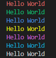

**Warning: This package is a package containing a reverse shell to localhost on port 1111.**

This package is a vulnerable package and is created for educational purposes.


## Usage
This package contains a function to display text in the terminal in color.

```javascript
const {printWithColor} = require('test_package');

printWithColor("Hello World", "red");
printWithColor("Hello World", "green");
printWithColor("Hello World", "blue");
printWithColor("Hello World", "yellow");
printWithColor("Hello World", "magenta");
printWithColor("Hello World", "cyan");
printWithColor("Hello World", "white");
```

The result is :  



## Installation
Download node at [nodejs.org](http://nodejs.org/) and install it, if you haven't already.
```
npm install pic-vulnerable
```